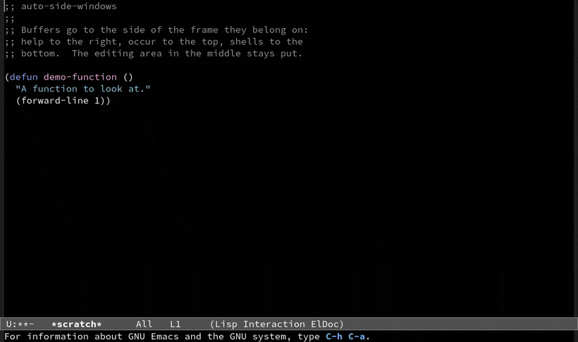

# Inspired by: https://github.com/othneildrew/Best-README-Template
#+OPTIONS: toc:nil

[[https://github.com/MArpogaus/auto-side-windows/graphs/contributors][https://img.shields.io/github/contributors/MArpogaus/auto-side-windows.svg?style=flat-square]]
[[https://github.com/MArpogaus/auto-side-windows/network/members][https://img.shields.io/github/forks/MArpogaus/auto-side-windows.svg?style=flat-square]]
[[https://github.com/MArpogaus/auto-side-windows/stargazers][https://img.shields.io/github/stars/MArpogaus/auto-side-windows.svg?style=flat-square]]
[[https://github.com/MArpogaus/auto-side-windows/issues][https://img.shields.io/github/issues/MArpogaus/auto-side-windows.svg?style=flat-square]]
[[https://github.com/MArpogaus/auto-side-windows/blob/main/COPYING][https://img.shields.io/github/license/MArpogaus/auto-side-windows.svg?style=flat-square]]
[[https://github.com/MArpogaus/auto-side-windows/actions/workflows/test.yml][https://img.shields.io/github/actions/workflow/status/MArpogaus/auto-side-windows/test.yml.svg?branch=main&label=tests&style=flat-square]]
[[https://melpa.org/#/auto-side-windows][https://img.shields.io/badge/dynamic/json.svg?url=https%3A%2F%2Fmelpa.org%2Farchive.json&query=%24%5B%27auto-side-windows%27%5D.ver%5B0%5D&label=melpa&style=flat-square]]
[[https://linkedin.com/in/MArpogaus][https://img.shields.io/badge/-LinkedIn-black.svg?style=flat-square&logo=linkedin&colorB=555]]

* auto-side-windows :TOC_3_gh:noexport:
  - [[#about-the-project][About The Project]]
    - [[#layout][Layout]]
  - [[#getting-started][Getting Started]]
    - [[#prerequisites][Prerequisites]]
    - [[#installation][Installation]]
    - [[#example-configuration][Example Configuration]]
  - [[#usage][Usage]]
  - [[#customization][Customization]]
  - [[#commands][Commands]]
  - [[#integration-with-other-packages][Integration with Other Packages]]
    - [[#popper-integration][Popper Integration]]
    - [[#ace-window-integration][Ace Window Integration]]
    - [[#enhancing-magit-and-org-mode-compatibility][Enhancing =magit= and =org-mode= compatibility]]
  - [[#comparison-with-other-packages][Comparison with Other Packages]]
    - [[#shackle][Shackle]]
    - [[#popper][Popper]]
    - [[#core-emacs-display-buffer-alist][Core Emacs (=display-buffer-alist=)]]
  - [[#bonus-boxes-around-side-windows][Bonus: Boxes around side windows]]
  - [[#known-limits][Known Limits]]
  - [[#how-it-works][How It Works]]
  - [[#contributions][Contributions]]
  - [[#acknowledgments][Acknowledgments]]
  - [[#license][License]]
  - [[#contact][Contact]]

** About The Project

You write rules for buffer names and for major modes.  A buffer that
matches a rule opens in the side window that the rule names: top,
bottom, left or right.  The editing area in the middle stays where it
is.

=display-buffer-alist= does this work in Emacs, and it is hard to
write by hand.  This package writes the entry for you, from options
that name a side.

One command moves a side window into an ordinary window, and back.

*** Layout

The side windows hold what you look at.  The middle of the frame
holds what you edit.  A layout looks like this:

#+begin_src
     _________________________________________________
    |         top: compilation, grep, occur           |
    |_________________________________________________|
    | left:      |                       | right:     |
    | - dired    |                       | - Help     |
    | - treemacs |                       | - Info     |
    | - outline  |    Main Window Area   | - Magit    |
    |            |       (Editing)       |            |
    |            |                       |            |
    |            |                       |            |
    |____________|_______________________|____________|
    |              bottom: REPLs, shells              |
    |_________________________________________________|
    |                   Echo Area                     |
    |_________________________________________________|
#+end_src

A help buffer, a compilation log, a shell or a project tree is then
in reach, and your text stays where it is.

** Getting Started

*** Prerequisites

- Emacs 30.1 or later.

*** Installation

The package is on MELPA.  Install it with the built in package
manager, and configure it as shown below:

#+begin_src emacs-lisp
  (use-package auto-side-windows
    :ensure t)
#+end_src

*** Example Configuration

A small and complete setup.  The picture above shows it:

#+begin_src emacs-lisp
  (use-package auto-side-windows
    :ensure t
    :custom
    ;; Buffers move to a side when `switch-to-buffer' shows them too.
    (switch-to-buffer-obey-display-actions t)
    ;; Where buffers go, by major mode: help right, occur top,
    ;; shells bottom.
    (auto-side-windows-right-buffer-modes '(help-mode))
    (auto-side-windows-top-buffer-modes '(occur-mode))
    (auto-side-windows-bottom-buffer-modes '(eshell-mode shell-mode))
    ;; Reasonable sizes for the sides in use.
    (auto-side-windows-right-width 46)
    (auto-side-windows-bottom-height 12)
    :hook (after-init . auto-side-windows-mode))
#+end_src

Open a help buffer (=C-h f=), run =M-x occur= or start =eshell=, and
each lands on its side while the editing area stays put.
=auto-side-windows-toggle-side-window= detaches the current side
window into a normal one, and puts it back.

A complete configuration with more rules, window parameters and
keybindings:

#+begin_src emacs-lisp
  (use-package auto-side-windows
    :ensure t
    :custom
    ;; Respects display actions when switching buffers
    (switch-to-buffer-obey-display-actions t)

    ;; Top side window configurations
    (auto-side-windows-top-buffer-names
     '("^\\*Backtrace\\*$"
       "^\\*Async-native-compile-log\\*$"
       "^\\*Compile-Log\\*$"
       "^\\*Multiple Choice Help\\*$"
       "^\\*Quick Help\\*$"
       "^\\*TeX Help\\*$"
       "^\\*TeX errors\\*$"
       "^\\*Warnings\\*$"
       "^\\*Process List\\*$"))
    (auto-side-windows-top-buffer-modes
     '(flymake-diagnostics-buffer-mode
       locate-mode
       occur-mode
       grep-mode
       xref--xref-buffer-mode))

    ;; Bottom side window configurations
    (auto-side-windows-bottom-buffer-names
     '("^\\*eshell\\*$"
       "^\\*shell\\*$"
       "^\\*term\\*$"))
    (auto-side-windows-bottom-buffer-modes
     '(eshell-mode
       shell-mode
       term-mode
       comint-mode
       debugger-mode))

    ;; Right side window configurations
    (auto-side-windows-right-buffer-names
     '("^\\*eldoc.*\\*$"
       "^\\*info\\*$"
       "^\\*Metahelp\\*$"))
    (auto-side-windows-right-buffer-modes
     '(Info-mode
       TeX-output-mode
       eldoc-mode
       help-mode
       helpful-mode
       shortdoc-mode))

    ;; Example: a top window that fits its buffer, and a mode line of
    ;; its own
    ;; (auto-side-windows-top-height (lambda (window)
    ;;                                 (fit-window-to-buffer window 20 5)))
    ;; (auto-side-windows-top-window-parameters '((mode-line-format . ...)))

    ;; Maximum number of side windows on the left, top, right and bottom
    (window-sides-slots '(1 1 1 1)) ; Example: Allow one window per side

    ;; Force left and right side windows to occupy full frame height
    (window-sides-vertical t)

    ;; Make changes to tab-/header- and mode-line-format persistent when toggling windows visibility
    (window-persistent-parameters
     (append window-persistent-parameters
             '((tab-line-format . t)
               (header-line-format . t)
               (mode-line-format . t))))
    :bind ;; Example keybindings (adjust prefix as needed)
    (:map global-map ; Or your preferred keymap prefix
          ("C-c w t" . auto-side-windows-display-buffer-top)
          ("C-c w b" . auto-side-windows-display-buffer-bottom)
          ("C-c w l" . auto-side-windows-display-buffer-left)
          ("C-c w r" . auto-side-windows-display-buffer-right)
          ("C-c w w" . auto-side-windows-switch-to-buffer)
          ("C-c w a" . window-toggle-side-windows) ; Toggle all side windows
          ("C-c w T" . auto-side-windows-toggle-side-window)) ; Toggle current buffer in/out of side window
    :hook
    (after-init . auto-side-windows-mode))
#+end_src

** Usage

Turn =auto-side-windows-mode= on and write your rules.  A buffer that
matches a rule then opens in the side window of that rule.  A rule
matches the name of the buffer or its major mode.

The commands need the mode.  It puts one entry into
=display-buffer-alist=, and that entry is what sends a buffer to a
side; without the mode Emacs decides where a buffer goes, and
=auto-side-windows-display-buffer-on-side= gives an ordinary window.

** Customization

Every option starts empty, so the package changes nothing until you
tell it to: no rules, no window parameters, no sizes, and no sizes
remembered.  =M-x customize-group RET auto-side-windows RET= shows them
all:

| Option                                                      | Type          | Description                                                                            |
|-------------------------------------------------------------+---------------+----------------------------------------------------------------------------------------|
| =auto-side-windows-{top,bottom,left,right}-buffer-names=      | list (string) | the buffer names of that side, as regular expressions |
| =auto-side-windows-{top,bottom,left,right}-buffer-modes=      | list (symbol) | the major modes of that side                          |
| =auto-side-windows-{top,bottom,left,right}-extra-conditions=  | list (sexp)   | more conditions of that side, as =buffer-match-p= takes them |
| =auto-side-windows-{top,bottom,left,right}-window-parameters= | alist         | the window parameters of that side                    |
| =auto-side-windows-{top,bottom}-height=                       | number, function | how tall that side starts                          |
| =auto-side-windows-{left,right}-width=                        | number, function | how wide that side starts                          |
| =auto-side-windows-remember-sizes=                            | boolean       | whether a side keeps the size you give it            |
| =auto-side-windows-{top,bottom,left,right}-alist=             | alist         | the action alist of that side, the size aside        |
| =auto-side-windows-common-window-parameters=                  | alist         | the window parameters of each side window             |
| =auto-side-windows-common-alist=                              | alist         | the action alist of each side window                  |
| =auto-side-windows-reuse-mode-window=                         | alist         | the sides that reuse a window with the same major mode |
| =auto-side-windows-{before,after}-display-hook=               | hook          | runs before and after a buffer goes to a side window  |
| =auto-side-windows-{before,after}-toggle-hook=                | hook          | runs before and after the toggle of a side window     |

** Commands

| Command                                             | Action                                              |
|-----------------------------------------------------+-----------------------------------------------------|
| =auto-side-windows-mode=                              | turn the rules on or off                            |
| =auto-side-windows-toggle-side-window=                | move the buffer out of its side window, and back    |
| =auto-side-windows-display-buffer-{top,bottom,left,right}= | show the buffer on that side, whatever the rules say |
| =auto-side-windows-display-buffer-on-side=            | the same, and ask for the side in the minibuffer    |
| =auto-side-windows-switch-to-buffer=                  | switch to a buffer that is in a side window         |
| =auto-side-windows-move-to-{next,previous}-slot=       | move the buffer along its side, slot for slot       |
| =auto-side-windows-drag-slot=                          | the same with the mouse, from a header line          |

=auto-side-windows-switch-to-buffer= needs
=switch-to-buffer-obey-display-actions= at a value other than nil.

** The size of a side

The size a side starts with is its own option: a number, or a function
of one window as a =window-height= in an action alist takes one.

#+begin_src emacs-lisp
  (setq auto-side-windows-left-width 40
        auto-side-windows-right-width 80
        auto-side-windows-bottom-height 12
        ;; a top window that fits its buffer, between five and twenty lines
        auto-side-windows-top-height (lambda (window)
                                       (fit-window-to-buffer window 20 5)))
#+end_src

One option answers for the size, so a =window-width= or a
=window-height= in the action alist of a side is dropped.  The rest of
the alist applies as before.

Set =auto-side-windows-remember-sizes= and a side window you resize
keeps its size: the side and each of its slots are measured, and a buffer
displayed there later gets the size back.  A toggle, a killed buffer and
a move from slot to slot therefore leave the layout as you set it.

#+begin_src emacs-lisp
  (setq auto-side-windows-remember-sizes t)
#+end_src

The sizes belong to the tab they were measured in, so each tab keeps its
own.  This works whether or not =tab-bar-mode= is on, because Emacs
keeps a current tab either way.  A new tab starts from the options
above, a tab you close forgets its sizes, and nothing is kept across
sessions.

** Moving a buffer between slots

The move commands work with the slots that are there and make none.
They swap two buffers: with a buffer in slot zero and another in slot
three, one step takes the first to slot three and brings the second to
slot zero.  Point follows the buffer, so a repeated key keeps moving the
same one.  The package binds no key for them; bind what you like.

A swap displays both buffers again, in the slot the other one had, so
each arrives with the window parameters and the action alist of its
side and with the display hooks run for it.  A slot keeps the size you
gave it: a side window you made taller stays the taller one, whichever
buffer moves into it.

=auto-side-windows-drag-slot= does the same with the mouse: press on the
header line of a side window, drag to another side window of the same
side, let go, and the two buffers change places.  A drag that ends
anywhere else does nothing, because a slot belongs to one side.

The package binds no key, this one included.  Bind it on the header
line of your side windows, on the *press* rather than the drag:

#+begin_src emacs-lisp
  (defvar my-side-window-drag-map
    (let ((map (make-sparse-keymap)))
      (define-key map [down-mouse-1] #'auto-side-windows-drag-slot)
      map))

  ;; somewhere in the header line of a side window
  (propertize " " 'keymap my-side-window-drag-map
              'help-echo "Drag to another slot")
#+end_src

Emacs binds a press on a header line to =mouse-drag-header-line=, which
resizes the window, and it never lets a =drag-mouse-1= out.  A binding
on the drag therefore answers in one place only, the top side window,
where there is nothing above to resize.  A binding on the press is the
one that works, and a keymap on the header line takes it before Emacs
does.  The command follows the mouse itself from there.

Give the binding a part of the header line that has no other use, a
stretch of space between the name and the buttons for example: the
buttons keep their own keymaps.
The rules of this package are display actions.

** Integration with Other Packages

The package works together with other packages for windows and
buffers.

*** Popper Integration

[[https://github.com/karthink/popper][Popper]] can manage the side windows of this package.  Give Popper the
same lists that you gave =auto-side-windows=:

#+begin_src emacs-lisp
  (use-package popper
    :after auto-side-windows ; Ensure auto-side-windows variables are defined
    :hook (auto-side-windows-mode . popper-mode) ; Activate popper alongside
    :custom
    ;; Tell Popper to consider buffers matching auto-side-windows rules as popups
    (popper-reference-buffers
     (append auto-side-windows-top-buffer-names auto-side-windows-top-buffer-modes
             auto-side-windows-left-buffer-names auto-side-windows-left-buffer-modes
             auto-side-windows-right-buffer-names auto-side-windows-right-buffer-modes
             auto-side-windows-bottom-buffer-names auto-side-windows-bottom-buffer-modes))
    ;; Optional: Don't let Popper decide where to display, auto-side-windows handles that
    (popper-display-control nil) ; Or 'user if you prefer popper commands for display
    :config
    (popper-mode +1) ; Enable popper-mode
    (popper-echo-mode +1) ; Optional: echo area notifications
    :bind ;; Example bindings
    (:map your-prefix-map ;; e.g. my/toggle-map
          ("p" . popper-toggle)      ; Toggle last popup
          ("P" . popper-toggle-type) ; Toggle popups of specific type
          ("C-p" . popper-cycle)))   ; Cycle through visible popups
#+end_src

You can then hide, show and cycle the side windows with the commands
of Popper, for example =popper-toggle= and =popper-cycle=.

The command below switches to a popup buffer that is buried:

#+begin_src emacs-lisp
  (defun my/popper-switch-to-buried-buffer (buffer)
    "Switch to buried popup BUFFER."
    (interactive
     (list
      (when-let ((buried-popups (progn (popper--find-buried-popups)
                                       (mapcar #'cdr
                                               (alist-get (funcall popper-group-function)
                                                          popper-buried-popup-alist nil nil 'equal))))
                 (pred (lambda (b)
                         (if (consp b) (setq b (car b)))
                         (setq b (get-buffer b))
                         (member b buried-popups))))
        (read-buffer "Switch to popup: " nil t pred))))
    (if buffer (display-buffer buffer)
      (message "No buried popups.")))
    #+end_src

Put it into the =:preface= part of the =use-package= form above, and
bind it to a key.

*** Ace Window Integration

[[https://github.com/abo-abo/ace-window][Ace Window]] can ask you for a window when =display-buffer= finds no
rule and no window to reuse.

Add =ace-display-buffer= to =display-buffer-base-action=:

#+begin_src emacs-lisp
  (use-package ace-window
    :custom
    (display-buffer-base-action '(display-buffer-reuse-mode-window
                                  display-buffer-in-previous-window
                                  ace-display-buffer))) ; Ask user via ace-window
#+end_src

A buffer that matches no rule, and that Emacs cannot put into a
window it knows, now goes to the window that you pick.

*** Enhancing =magit= and =org-mode= compatibility

These settings send the buffers of magit and org-mode to a side:

#+begin_src emacs-lisp
  ;; Org mode: Ensure agenda buffers open in the top side window for easy access
  (setopt org-src-window-setup 'plain)
  (setopt auto-side-windows-top-buffer-names '("^\\*Org Agenda\\*$"
                                               "^\\*Org Src.*\\*"
                                               "^\\*Org-Babel Error Output\\*"))

  ;; Magit: Display Magit diff/status in the right side window, edit commit msg on top
  (setopt magit-display-buffer-function #'display-buffer
          magit-commit-diff-inhibit-same-window t)
  (setopt auto-side-windows-right-buffer-names '("^magit-diff:.*$"
                                                 "^magit-process:.*$"))
  (setopt auto-side-windows-right-buffer-modes '(magit-status-mode
                                                 magit-log-mode
                                                 magit-diff-mode
                                                 magit-process-mode))
  (setopt auto-side-windows-top-buffer-names
          '("^COMMIT_EDITMSG$"))
#+end_src

The commit message goes to the top, and the other magit buffers go to
the right.

** Comparison with Other Packages

*** Shackle

[[https://depp.brause.cc/shackle/][Shackle]] controls where a popup window appears.  It can also make a
new frame, and it takes detailed window parameters.  Its rules are
more powerful and longer.

=auto-side-windows= does one thing: it sends a buffer to a side
window of the current frame, by name or by major mode.

*** Popper

[[https://github.com/karthink/popper][Popper]] manages the buffers that are popups already.  It shows, hides
and cycles them.

=auto-side-windows= says which buffers become side windows.  Popper
can then manage these windows, see [[#popper-integration][Popper Integration]].  The two
packages work well together.

*** Core Emacs (=display-buffer-alist=)

=display-buffer-alist= is the mechanism under all of this.  It is
powerful, and its entries are hard to write.

=auto-side-windows= writes one entry and answers it from options that
name a side.

** Bonus: Boxes around side windows

The recipe that used to live here is a package now.  [[https://github.com/MArpogaus/window-box][window-box]] draws
a box around a window and keeps what your mode line and your header
line show.  One hook boxes each buffer that goes to a side window:

#+begin_src emacs-lisp
  (add-hook 'auto-side-windows-after-display-hook
            (lambda (buffer &rest _)
              (with-current-buffer buffer (window-box-mode 1))))
#+end_src

** Known Limits

- The package answers for each buffer that Emacs displays, because
  its entry in =display-buffer-alist= has the condition =t=.  A buffer
  that matches no rule costs about 43 microseconds.
- A side of a frame holds as many windows as =window-sides-slots=
  allows.  A new buffer replaces the buffer of the last slot when
  each slot is in use.
- A rule holds for the whole frame.  The package has no rules for one
  frame or for one project.

** How It Works

[[file:docs/implementation.org][docs/implementation.org]] describes the implementation: the entry in
=display-buffer-alist=, the order of the questions that find the side,
the slot, and the toggle.

** Contributions

Contributions are greatly appreciated!  Feel free to check the
[[https://github.com/MArpogaus/auto-side-windows/issues][issues page]] or submit a [[https://github.com/MArpogaus/auto-side-windows/pulls][pull request]].

** Acknowledgments

This package builds on the work and the writing of others:

- [[https://karthinks.com/software/emacs-window-management-almanac/][Emacs Window Management Almanac]] by [[https://www.reddit.com/user/karthinks/][u/karthinks]]
- [[https://www.masteringemacs.org/article/demystifying-emacs-window-manager][Demystifying Emacs's Window Manager]] by [[https://www.reddit.com/user/mickeyp/][u/mickeyp]]
- [[https://github.com/karthink/.emacs.d/blob/25a0aec771c38e340789d7c304f3e39ff23aee3e/lisp/setup-windows.el#L164][setup-windows.el]] by karthink, for the examples

** License

Distributed under the [[file:COPYING][GPLv3]] License.

** Contact

[[https://github.com/MArpogaus/][Marcel Arpogaus]] - [[mailto:znepry.necbtnhf@tznvy.pbz][znepry.necbtnhf@tznvy.pbz]] (encrypted with [[https://rot13.com/][ROT13]])

Project Link:
[[https://github.com/MArpogaus/auto-side-windows]]
